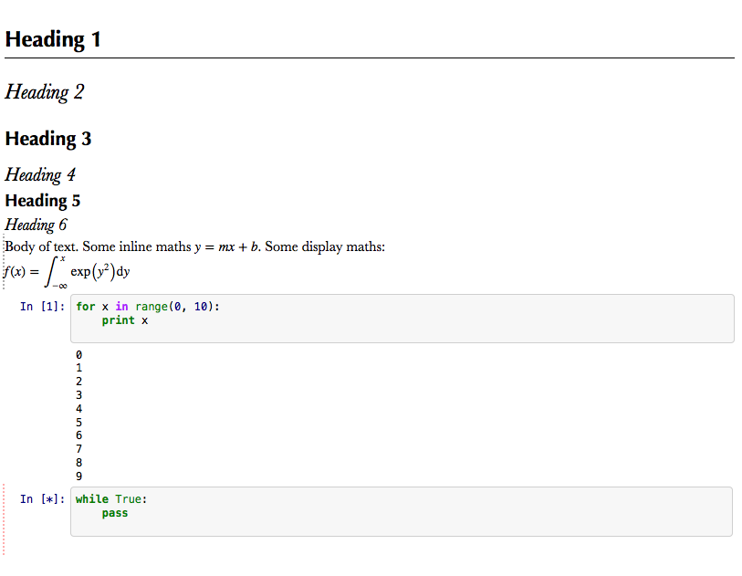

Improved IPython Notebook Formatting
====================================

Setup
-----

Clone this into a new IPython profile. 

Features
--------

* Better heading spacing (in my opinion).
* Less intrusive active cell highlighting.
* Highlight running cell

Caveats
-------

* I haven't testes this much
* Not an expert on CSS, probably some bad practices used.
* Uses fonts that look good on Mac. May not be available elsewhere.
* Still plenty of rough edges.

Sample
------

